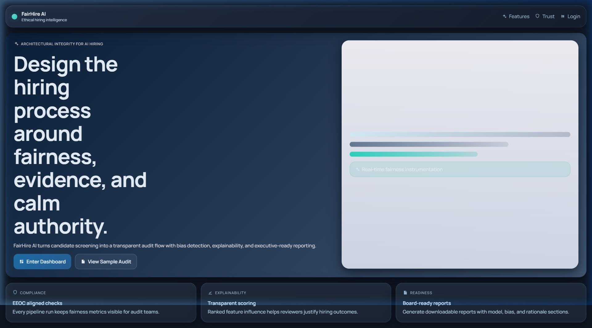
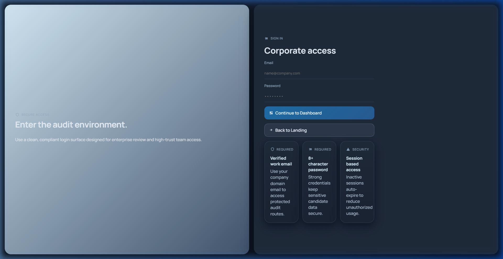
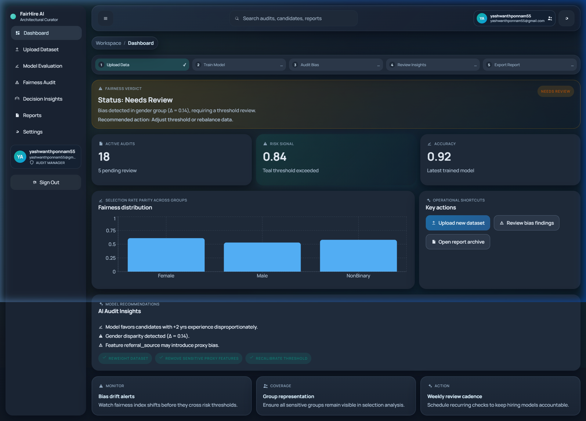
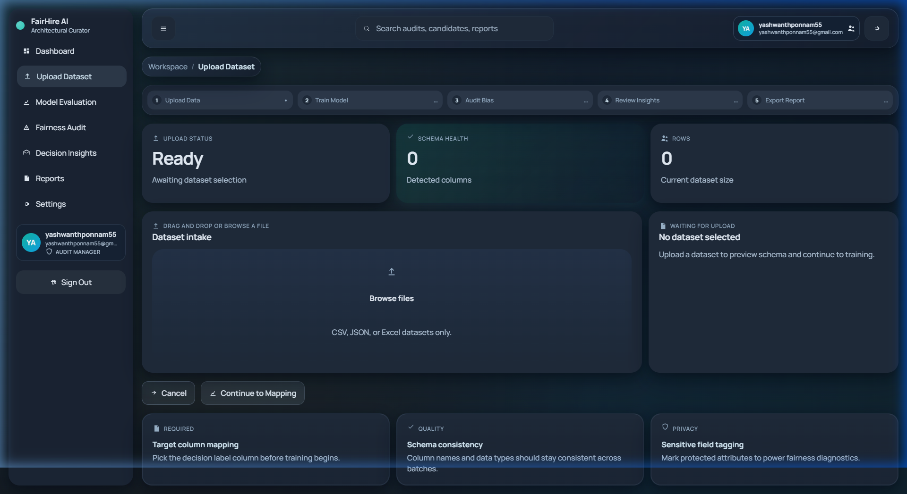
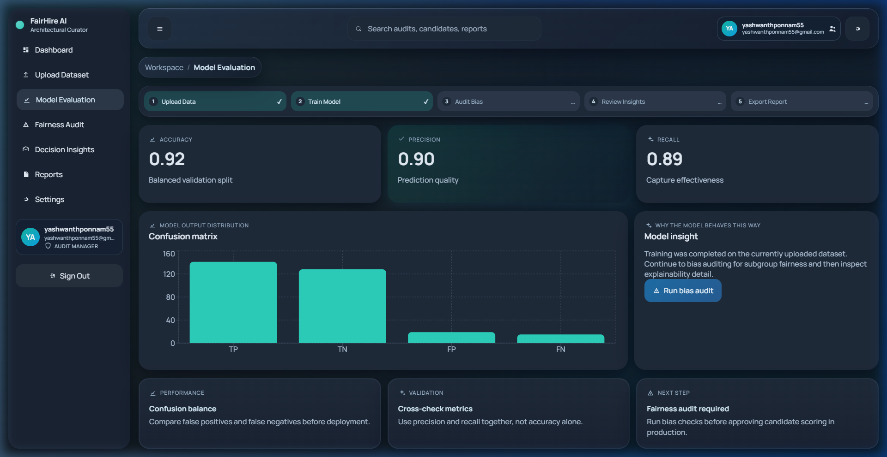
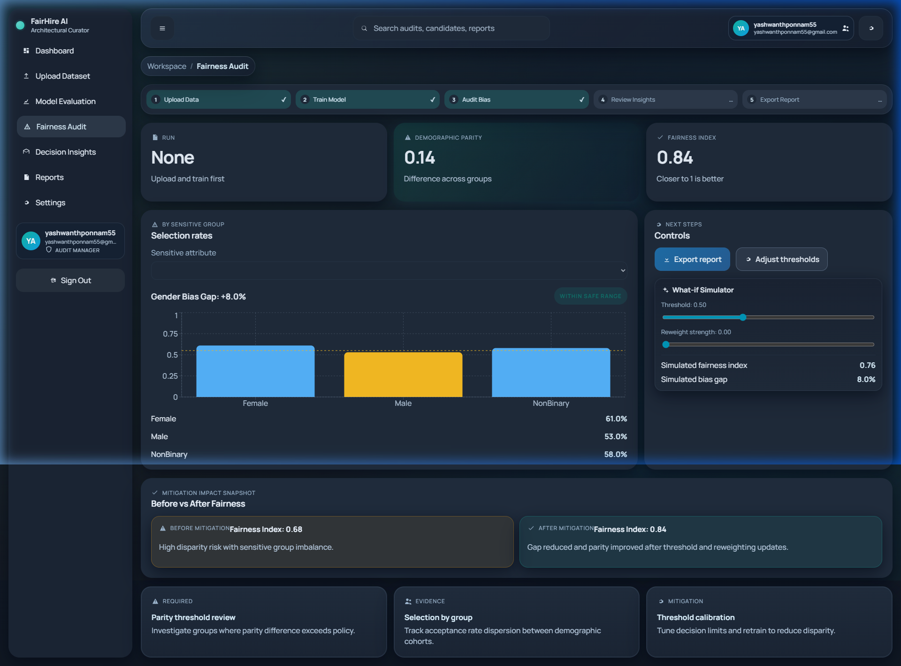
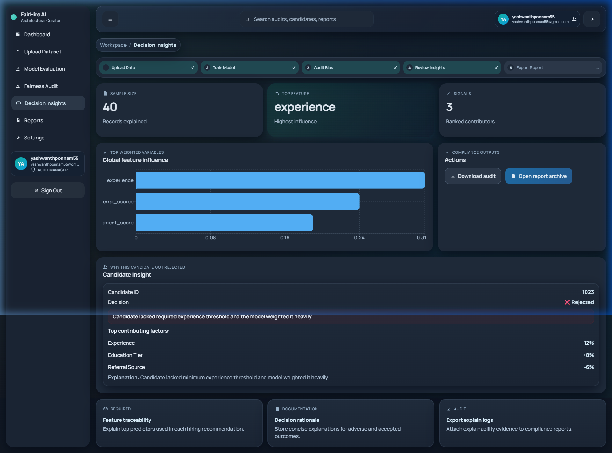
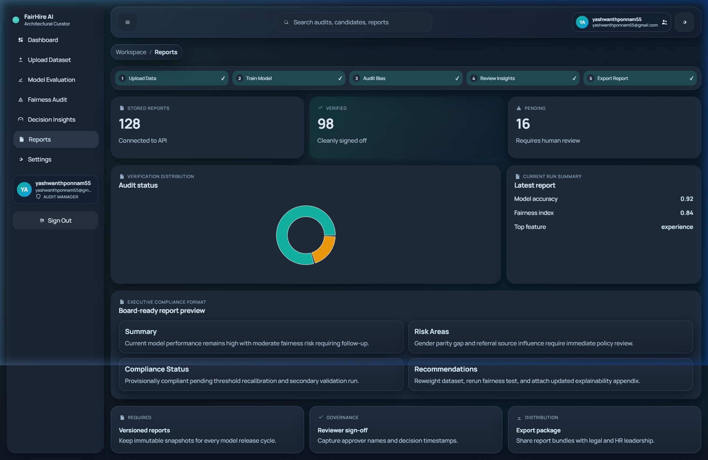
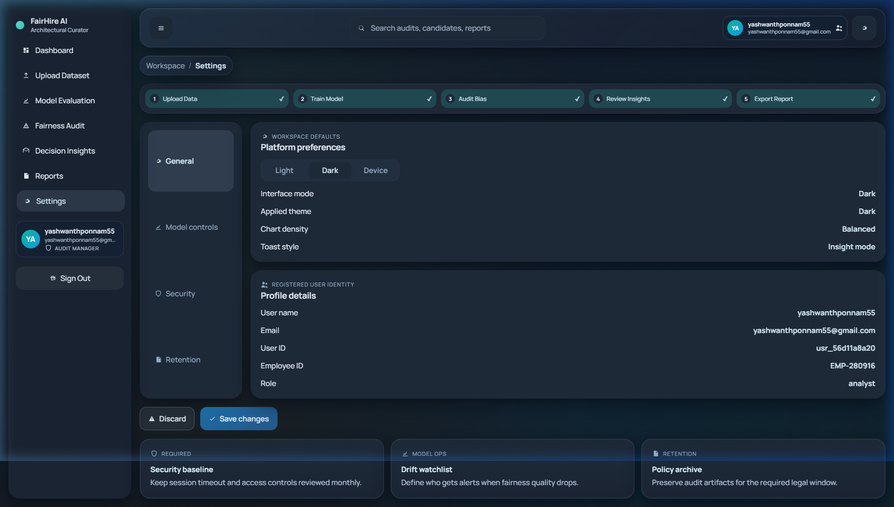

# FairHire AI

Enterprise hiring intelligence platform for fairness auditing, explainability, and compliance-grade reporting.

[](https://fairhire-67f38.web.app)
[](https://python.org)
[](https://fastapi.tiangolo.com)
[](https://react.dev)
[](https://vite.dev)
[](https://firebase.google.com)
[](https://scikit-learn.org)
[](https://shap.readthedocs.io)

## Table of Contents

- [30-Second Judge Pitch](#30-second-judge-pitch)
- [Product Demo (GIF)](#product-demo-gif)
- [Why FairHire AI](#why-fairhire-ai)
- [Key Capabilities](#key-capabilities)
- [Tech Stack](#tech-stack)
- [Live Deployment](#live-deployment)
- [Product Walkthrough (Screenshots)](#product-walkthrough-screenshots)
- [Architecture](#architecture)
- [API Surface](#api-surface)
- [Local Setup](#local-setup)
- [Deployment (Firebase Hosting)](#deployment-firebase-hosting)
- [Demo Dataset](#demo-dataset)
- [License](#license)

## 30-Second Judge Pitch

**Problem:** Hiring models can look accurate while still producing unfair outcomes that are hard to explain to HR, legal, and leadership.

**Solution:** FairHire AI unifies model evaluation, bias auditing, explainability, what-if simulation, and compliance reporting into one guided enterprise workflow.

**Impact:** Teams move from raw dataset to a board-ready fairness narrative in minutes, with clear risk signals, mitigation paths, and accountable decision rationale.

## Product Demo (GIF)


## Why FairHire AI

FairHire AI helps teams move from raw hiring data to decision-ready fairness evidence with a guided flow:

1. Upload hiring data.
2. Train and evaluate model performance.
3. Audit fairness across sensitive groups.
4. Explain candidate-level and global model behavior.
5. Export executive-ready reports.

## Key Capabilities

| Capability | What it does |
|---|---|
| Fairness Verdict Banner | Immediate risk signal with actionable remediation guidance |
| Guided Workflow Bar | Upload → Train → Audit → Rationale → Report progression across pages |
| What-if Simulator | Interactive threshold and reweight controls for fairness impact simulation |
| Bias Audit | Group-wise selection rates, demographic parity, and fairness index tracking |
| Decision Rationale | Feature-level influence and candidate-level explanation outputs |
| Executive Reports | Summary, risk areas, compliance status, and recommendations in one view |

## Tech Stack

| Layer | Stack |
|---|---|
| Frontend | React 19, Vite, Recharts, custom design system (single-page dashboard app) |
| Backend | FastAPI, Pydantic, scikit-learn, SHAP, NumPy/Pandas |
| Data & Auth | Firebase Firestore, Firebase Auth |
| Deployment | Firebase Hosting (frontend), local/uvicorn backend |
| Testing | Vitest + Testing Library (frontend), pytest + FastAPI TestClient (backend) |

## Live Deployment

- Web app: https://fairhire-67f38.web.app
  
## Product Walkthrough (Screenshots)

### Landing



### Login



### Dashboard



### Upload Dataset



### Model Evaluation



### Fairness Audit



### Decision Rationale



### Reports



### Settings



## Architecture

```text
FairHire AI/
|- backend/
|  |- app/
|  |  |- main.py            # API routes and orchestration
|  |  |- ml_pipeline.py     # Training, fairness, explainability logic
|  |  |- schemas.py         # Request and response contracts
|  |  |- store.py           # Run and dataset state persistence helpers
|  |- data/
|  |  |- sample_dataset.csv # Demo data for end-to-end flow
|- frontend/
|  |- src/
|  |  |- App.jsx            # Main SPA shell and all pages
|  |  |- index.css          # Design system and theme tokens
|- firebase.json
|- .firebaserc
|- docker-compose.yml
|- requirements.txt
```

## API Surface

| Method | Endpoint | Description |
|---|---|---|
| GET | /health | Liveness check |
| GET | /runs | List run history |
| POST | /upload | Upload dataset for analysis |
| POST | /train | Train model with selected target column |
| GET | /bias | Compute fairness metrics for run and sensitive attribute |
| GET | /explain | Generate explainability outputs |
| GET | /report | Build consolidated audit report |
| POST | /simulate/whatif | Simulate threshold and reweighting changes |
| POST | /simulate/batch | Batch simulation grid |

Swagger docs are available at http://localhost:8000/docs when backend is running.

## Local Setup

### Prerequisites

- Python 3.10+
- Node.js 18+
- npm and pip

### Run Backend

```bash
python -m venv .venv
# Windows
.venv\Scripts\activate
# macOS/Linux
# source .venv/bin/activate

pip install -r requirements.txt
cd backend
uvicorn main:app --reload --port 8000
```

### Run Frontend

```bash
cd frontend
npm install
npm run dev
```

### Run Tests

```bash
# backend
cd backend
pytest -q tests

# frontend
cd frontend
npm run test:run
```

## Deployment (Firebase Hosting)

```bash
cd frontend
npm run build

cd ..
npx firebase-tools deploy --only hosting --project fairhire-67f38
```

## Demo Dataset

Use the provided dataset at backend/data/sample_dataset.csv to run the full pipeline quickly.

## License

MIT
